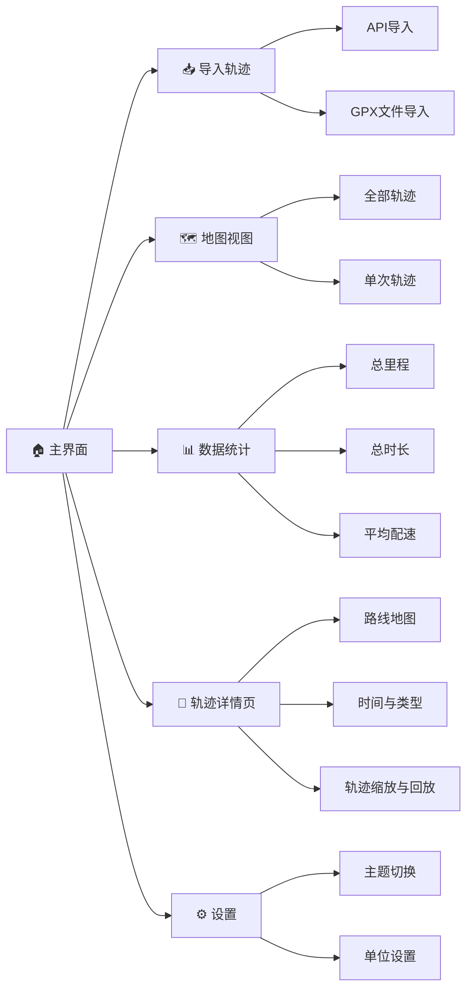

## 界面功能设计

```mermaid
graph LR
    A[🏠 主界面] --> B1[📥 导入轨迹]
    A --> B2[🗺️ 地图视图]
    A --> B3[📊 数据统计]
    A --> B4[🧭 轨迹详情页]
    A --> B5[⚙️ 设置]
    B1 --> C1[API导入]
    B1 --> C2[GPX文件导入]
    B2 --> D1[全部轨迹]
    B2 --> D2[单次轨迹]
    B3 --> E1[总里程]
    B3 --> E2[总时长]
    B3 --> E3[平均配速]
    B4 --> F1[路线地图]
    B4 --> F2[时间与类型]
    B4 --> F3[轨迹缩放与回放]
    B5 --> G1[主题切换]
    B5 --> G2[单位设置]

```

